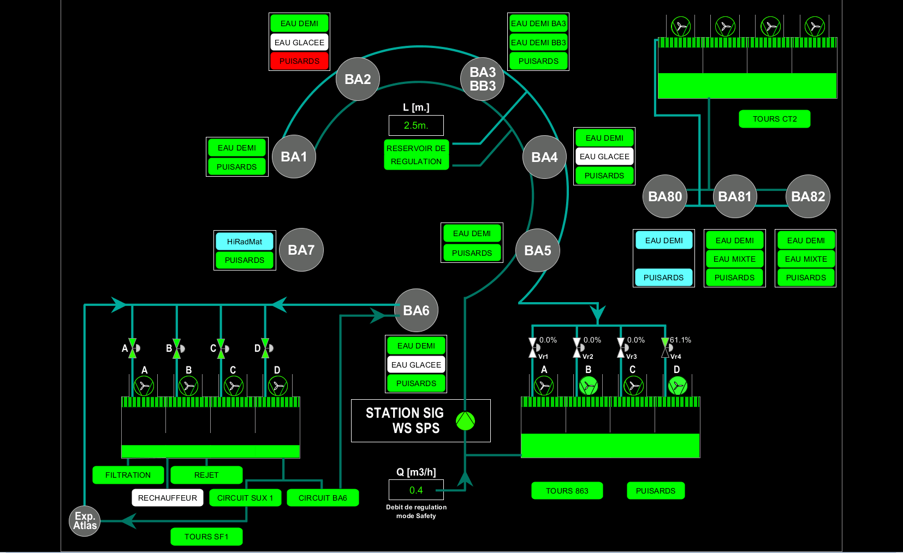

Two major systems at CERN are based on C2MON and contributing features to the platform. Come and join our community and see how C2MON will meet also your monitoring requirements.


> Video demonstrating TIM in action!

---

## TIM - Technical Infrastructure Monitoring

TIM is a 24/7 service at CERN to supervise and control a variety of infrastructure spread across the CERN sites.

TIM provides different types of Java and Web applications allowing operators for instance reacting to alarms, supervising maintenance operations, or monitoring access to the accelerator complex.

The main application is called "TIM Viewer", a generic Dashboard viewer for animating data coming from C2MON. Currently, the TIM Viewer hosts +200 Dashboards used by different user groups at CERN.

> Views showing the access status to the LHC tunnel and a CERN water Monitoring station ( SPS Accelerator ).

__TIM in numbers:__

* ~93'000 data tags, ~40'000 alarms, ~ 1'000 rules
* Up to 400 million raw data values per day
* After filtering ~ 2.2 million values are treated and stored by the C2MON server

---

## DIAMON - DIAgnostic and MONitoring

The purpose of the DIAMON project is to propose to the CERN operators and equipment groups tools to monitor the BE Controls infrastructure with easy to use, first line diagnostics and tools to solve problems, or help to decide about responsibilities for first line of intervention.

The BE Controls Infrastructure spans over huge distances around CERN and covers a multitude of different equipment (more than 3'000 items are eligible to be monitored)!
Main Objectives:

* Provide the [CERN Control Centre (CCC)](https://www.facebook.com/pages/CERN-Control-Centre-CCC/172354182781843) operators with precise and easy to use tools to monitor the behaviour of the BE Controls Infrastructure.
* Allow for an easy access to diagnostic tools providing more details and help to solve an eventual problem.

---

## Your use case?

Since C2MON is essentially a heterogeneous data acquisition framework with configuration, persistence, historical browsing, control and alarm functionalities, it can be suitable for building many different types of system.

For example, it is used internally at CERN as an industrial SCADA system; as a network monitoring system; as a central alarm aggregation service; and as a general-purpose data proxy.

Hope that makes C2MON also interesting for your business, since you could reuse it as open SCADA middleware whilst focusing on client application development.
C2MON could be used by you:

* To acquire and store data from different type of systems,
* To build up a simple or highly distributed or cloud based SCADA solution,
* To realise high-availability solutions with on-line reconfiguration,
* To share data from hundreds of thousands or even millions of data sensors with multiple types of applications,
* To cluster data acquisition with event notifications and to execute background tasks (e.g. rule or alarm evaluations),
* To centrally manage the subscription configuration from different type of systems,
* To define structured objects (Devices) on top of your data acquisition that can be re-used on the client tier,
* To create a data analysis framework,
* As simple data proxy,
* As filtering system to reduce for instance the noise of analogue sensors,
* As data recorder,
* As data history player for client applications to replay for instance highly complex synoptic dashboards.
